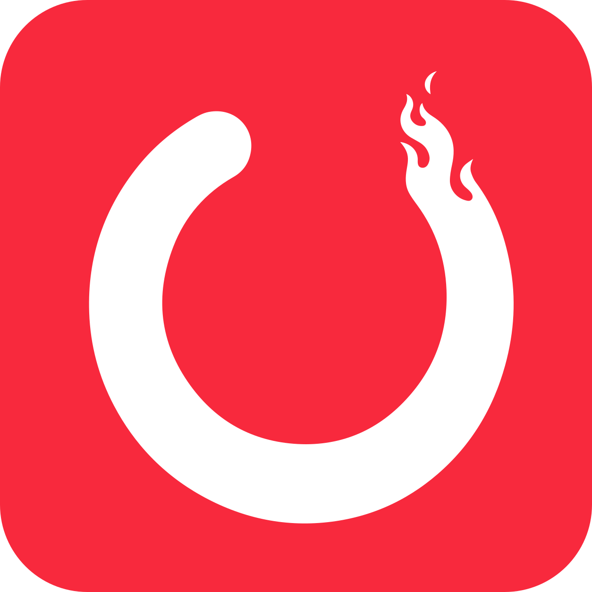
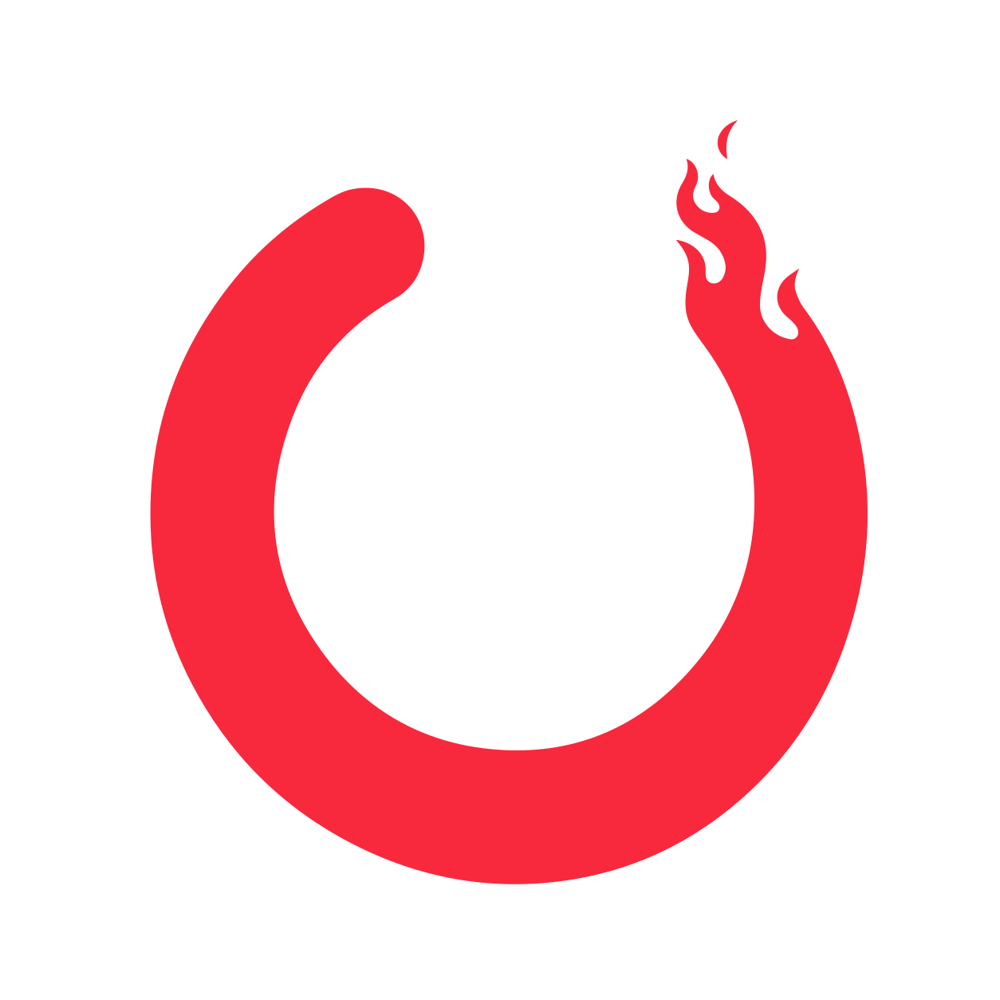

# TokenBurn Brand Guidelines

<p align="center">
  
</p>

<p align="center"><strong>TokenBurn</strong><br>AI usage at a glance for Windows.</p>

---

## 1. Brand idea

TokenBurn is a Windows developer utility for monitoring AI usage, quotas, resets, and spend across multiple providers.

The symbol is intentionally simple: a **chunky circular quota meter whose remaining arc ends in a flame**. The mark should be read in this order:

1. **Quota / progress meter**
2. **Usage being consumed**
3. **Burn / TokenBurn**

The logo should never become a generic fire symbol. The circular meter is the primary idea; the flame is the distinctive detail.

### Brand traits

- Practical
- Fast
- Developer-focused
- Glanceable
- Local / private
- Playful without looking gimmicky

---

## 2. Logo system

TokenBurn has two primary logo forms:

### A. App icon — primary product identifier


**File:** `assets/brand/logo/tokenburn-app-icon.svg`

Use this for:

- Windows app icon
- GitHub repository/social preview when a square icon is appropriate
- Store listing
- Installer artwork
- App shortcuts
- Profile/avatar use
- Favicons when a colored square is appropriate

The app icon consists of the white TokenBurn mark on the TokenBurn coral rounded-square field.

### B. Standalone mark — primary flexible brand mark



**File:** `assets/brand/logo/tokenburn-mark-coral.svg`

Use this when the logo needs to sit naturally inside another layout instead of appearing as an app tile.

Good uses include:

- README headers
- Website navigation
- Documentation
- Splash screens
- About pages
- Stickers or merchandise
- Presentation slides
- Footer branding

The standalone mark has **no background**.

---

## 3. Included logo files

| File | Background | Mark color | Recommended use |
|---|---|---|---|
| `tokenburn-app-icon.svg` | Coral rounded square | White | App icon, store, avatar, square placements |
| `tokenburn-mark-coral.svg` | Transparent | TokenBurn Coral | Default standalone logo on light/neutral backgrounds |
| `tokenburn-mark-white.svg` | Transparent | White | Dark UI, screenshots, dark marketing surfaces |
| `tokenburn-mark-black.svg` | Transparent | Black | One-color printing, documents, neutral monochrome contexts |
| `tokenburn-mark-currentcolor.svg` | Transparent | Inherits CSS `currentColor` | Web/docs where the mark should follow surrounding theme color |

Raster PNG exports are included under `exports/` at:

`256, 128, 64, 48, 32, 24, and 16 px`, plus ICO versions of the app and tray icons.

The SVG files are the source of truth. Use PNG only when the destination does not support SVG.

---

## 4. Which version should I use?

### On a light background

Use the **coral standalone mark**.

`assets/brand/logo/tokenburn-mark-coral.svg`

### On a dark background

Use the **white standalone mark**.

`assets/brand/logo/tokenburn-mark-white.svg`

### In Windows / app-store contexts

Use the **full app icon**.

`assets/brand/logo/tokenburn-app-icon.svg`

### In a single-color environment

Use the **black** or **white** standalone mark depending on contrast.

### In a website component where the color is controlled by CSS

Use:

`assets/brand/logo/tokenburn-mark-currentcolor.svg`

This file uses `fill="currentColor"`, allowing the logo to inherit the CSS text color.

---

## 5. Core colors

### TokenBurn Coral

**HEX:** `#F8293D`  
**RGB:** `248, 41, 61`

This is the primary TokenBurn brand color and the only colored fill used in the master logo.

### White

**HEX:** `#FFFFFF`

Used for the logo symbol inside the app icon and for the standalone mark on dark surfaces.

### Supporting charcoal

**HEX:** `#0F1115`

Recommended neutral for dark marketing backgrounds and supporting brand material. It is **not part of the master logo itself**.

### Color rule

The master logo should remain visually restrained. Do not introduce orange/yellow flame gradients, rainbow treatments, neon glows, or multiple flame colors.

The logo works because the **shape communicates burning**, rather than literal fire coloring.

---

## 6. Contrast and background rules

Use the version with the clearest silhouette against the surface behind it.

- **Light / white surface:** coral mark
- **Dark / charcoal surface:** white mark
- **Coral surface:** white mark
- **Busy screenshot/photo:** use the full app icon or place the standalone mark on a clean solid surface
- **Unknown/theme-controlled surface:** `currentColor` version if the host controls contrast correctly

Avoid placing the coral standalone mark directly over similarly saturated pink/red backgrounds.

TokenBurn Coral against white is excellent for a large logo mark, but it should not be treated as a default small-body-text color for accessibility-sensitive UI.

---

## 7. Clear space

Give the standalone mark room to breathe.

Maintain clear space on every side equal to at least **12.5% of the mark's rendered width**.

Example:

- 64 px mark → at least 8 px clear space
- 128 px mark → at least 16 px clear space
- 256 px mark → at least 32 px clear space

Nothing should visually touch the flame tip, the rounded left endpoint, or the outside edge of the ring.

For the app icon, do **not** add another border, badge, ring, or container around the existing rounded-square field unless required by the platform.

---

## 8. Minimum sizes

The mark was designed to survive Windows taskbar scale.

### Standalone mark

- **16 px:** supported minimum
- **24 px:** preferred minimum for ordinary UI
- **32 px+:** recommended for documentation and marketing

### App icon

- **16 px:** supported for Windows legacy/icon contexts
- **24–32 px:** preferred for taskbar/UI use
- **64 px+:** use for settings/about screens
- **256–1024 px:** use for store and marketing exports

At very small sizes, preserve the original silhouette. Do not add details to compensate for scale.

---

## 9. Shape integrity

The following features are essential and should not be altered casually:

- Thick circular quota ring
- Large circular negative space in the center
- Rounded clean endpoint on the left
- Open quota gap near the top
- Flame integrated into the right endpoint
- Flame follows the circular motion of the ring
- Simple, solid silhouette

If the mark is redrawn in the future, it must still look like a **quota meter first**.

---

## 10. Do not

Do **not**:

- Add `AI`, `$`, `%`, `TB`, or other characters inside the center hole
- Put a separate fire icon on top of the ring
- Turn the whole ring into a large flame
- Add detached sparks unless the official master artwork is intentionally changed
- Add gradients to the master logo
- Add 3D depth, bevels, glass, glow, or drop shadows to the master mark
- Stretch or squash the logo
- Rotate the logo
- Change the ring thickness independently
- Recolor the flame separately from the ring
- Outline the mark instead of filling it
- Put the logo inside another arbitrary circle or badge
- Use several similar reds in the same logo
- Replace the coral with provider brand colors

The TokenBurn logo is deliberately a **single silhouette**. Keep it that way.

---

## 11. App icon rules

The app icon is a distinct application asset, not just the standalone logo placed on any random red square.

Use the provided master:

`logo/tokenburn-app-icon.svg`

The rounded-square shape, padding, coral field, and white mark should remain consistent.

### Windows exports

When generating `.ico` or Windows assets, export from the SVG master rather than repeatedly rescaling a PNG.

Recommended embedded raster sizes:

- 16×16
- 24×24
- 32×32
- 48×48
- 64×64
- 128×128
- 256×256

Keep a 512×512 and 1024×1024 PNG available for store/marketing workflows.

---

## 12. Standalone transparent logo rules

The standalone mark is the best choice when the coral square would feel too heavy.

### Default

Use `tokenburn-mark-coral.svg` on light surfaces.

### Inverse

Use `tokenburn-mark-white.svg` on dark surfaces.

### Monochrome

Use `tokenburn-mark-black.svg` when printing or when only one ink/color is available.

### Theme-aware web use

Use `tokenburn-mark-currentcolor.svg` when a component should control the mark color.

Example:

```html

```

For the `currentColor` version, inline the SVG or use it through an SVG-aware theming method when inheritance is required.

---

## 13. Product name and typography

The product name is written exactly as:

**TokenBurn**

Capital `T`, capital `B`, no space.

Avoid:

- Token Burn
- tokenburn in marketing headings
- TOKENBURN as the primary product wordmark
- Tokenburn

### Recommended product typography

Because TokenBurn is a Windows-first utility, the preferred UI type family is:

**Segoe UI Variable / Segoe UI**

Recommended fallback stack:

```css
font-family: "Segoe UI Variable", "Segoe UI", Inter, system-ui, sans-serif;
```

For a simple logo lockup, typeset **TokenBurn** in Semibold next to the standalone mark. Do not stylize the letters into flames or modify individual characters.

There is currently **no separate outlined custom wordmark asset**. The icon/mark is the distinctive proprietary visual element; the product name remains normal typography.

---

## 14. Suggested logo lockup

When the mark and product name appear together:

- Place the standalone mark to the left
- Set `TokenBurn` on one line
- Vertically center the text against the visual center of the mark
- Use Semibold rather than Extra Bold
- Leave approximately **0.35× the mark width** between the mark and the word

Example proportions:

- 32 px mark
- ~11 px gap
- 20–24 px product-name text depending on context

Do not squeeze the name into the center of the ring.

---

## 15. GitHub usage

### Repository social/avatar

Use the full app icon.

### README hero

Recommended structure:

```md
<p align="center">
  
</p>

<h1 align="center">TokenBurn</h1>
<p align="center">AI usage at a glance for Windows.</p>
```

If the README must look good in both GitHub light and dark mode without theme-specific picture sources, the **full app icon** is the safest choice because it carries its own background.

### Badges

Do not reduce the TokenBurn logo to a tiny decorative badge if it becomes illegible. Use text badges normally and reserve the mark for the repository identity.

---

## 16. Website usage

### Header/navigation

Use the standalone mark + `TokenBurn` text lockup.

### Hero

Either:

- large standalone coral mark on a clean neutral background, or
- full app icon when visually introducing the Windows app itself

### Footer

Use a small standalone mark with the product name. White is preferred on a dark footer.

### Favicon

Use the app icon or a purpose-made export derived from it. At very tiny favicon sizes, prioritize the white ring/flame silhouette and strong coral field.

---

## 17. Screenshot and video usage

When showing TokenBurn inside screenshots or demo videos:

- Prefer the real app UI rather than placing oversized logos on top of it
- Keep the logo out of the way of quota values
- Use the app icon for title cards
- Use the standalone white mark over dark title cards
- Do not add animated flames to the logo just because the product is called TokenBurn

If an animated brand treatment is created later, animate the **quota being consumed around the ring**, not a generic flickering flame.

---

## 18. Motion direction (future)

If the mark is animated, the intended story is:

**remaining quota → consumption around circumference → flame frontier**

Good motion ideas:

- Circular quota slowly decreases
- Flame endpoint advances around the ring
- Meter subtly fills/empties during loading

Avoid:

- Flame flickering independently like a campfire
- Logo bouncing
- Sparks exploding outward
- Constant attention-seeking animation in the taskbar

TokenBurn should remain glanceable and calm.

---

## 19. Tone of voice

TokenBurn can be playful, but the software itself should feel credible.

Preferred copy:

- Short
- Specific
- Developer-oriented
- Slightly witty when appropriate
- Not corporate
- Not overloaded with AI buzzwords

Examples:

**Good:**

- `7% remaining`
- `Resets in 3h 42m`
- `Next update in 5m`
- `Your AI usage, right on the taskbar.`

Avoid copy such as:

- `Revolutionize your AI productivity journey`
- `Unlock next-generation intelligence insights`
- `Supercharge your AI ecosystem`

---

## 20. Relationship to OpenUsage

TokenBurn should have its **own name and visual identity** even when acknowledging its project lineage.

Attribution to OpenUsage belongs in places such as:

- README
- About screen
- License / notices
- Repository documentation

It should **not** be incorporated into the TokenBurn logo itself.

A clear attribution line is better than blending the two brands visually.

---

## 21. Source-of-truth rule

The vector masters under `assets/brand/logo/` are authoritative.

Do not edit a 16 px PNG and then scale it back up.

Preferred workflow:

1. Edit the SVG master if the logo intentionally changes.
2. Review at large size.
3. Review at 64, 32, 24, and 16 px.
4. Export raster assets from the approved SVG.
5. Replace platform-specific assets from those exports.

---

## 22. File naming

Use lowercase, descriptive names for brand assets:

```text
tokenburn-app-icon.svg
tokenburn-mark-coral.svg
tokenburn-mark-white.svg
tokenburn-mark-black.svg
tokenburn-mark-currentcolor.svg
```

For raster exports:

```text
tokenburn-app-icon-256.png
tokenburn-mark-gray-32.png
```

Avoid names such as:

```text
logo-final.svg
logo-final-final2.svg
newlogo.png
icon_good_REAL.png
```

---

## 23. Quick-reference checklist

Before publishing a TokenBurn logo, confirm:

- [ ] It still reads as a circular quota/progress meter first
- [ ] The flame is integrated into the ring
- [ ] The center remains empty
- [ ] The mark is not stretched or rotated
- [ ] Contrast is strong enough for the background
- [ ] The correct coral is `#F8293D`
- [ ] The app icon uses a white mark
- [ ] The standalone default mark uses TokenBurn Coral
- [ ] Small-size use has been checked at 16–24 px
- [ ] No unnecessary effects or extra fire graphics were added

---

## 24. Asset directory

```text
TokenBurn-Brand/
├── BRAND.md
├── logo/
│   ├── tokenburn-app-icon.svg
│   ├── tokenburn-mark-coral.svg
│   ├── tokenburn-mark-white.svg
│   ├── tokenburn-mark-black.svg
│   └── tokenburn-mark-currentcolor.svg
└── exports/
    ├── tokenburn-app-icon-16.png
    ├── tokenburn-app-icon-24.png
    ├── tokenburn-app-icon-32.png
    ├── tokenburn-app-icon-48.png
    ├── tokenburn-app-icon-64.png
    ├── tokenburn-app-icon-128.png
    ├── tokenburn-app-icon-256.png
    ├── tokenburn-app-icon.ico
    ├── tokenburn-mark-gray-16.png
    ├── tokenburn-mark-gray-20.png
    ├── tokenburn-mark-gray-24.png
    ├── tokenburn-mark-gray-32.png
    ├── tokenburn-mark-gray.ico
    └── tokenburn-tray-icon.ico
```

---

## 25. Master brand rule

**Do not make the fire louder than the quota meter.**

That is the visual idea that makes TokenBurn distinctive.
